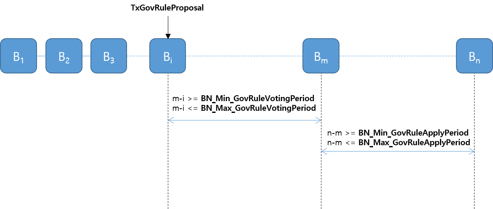

## Simple Summary

LogiChain 네트워크의 Validator 중 일정조건을 만족하는 Validator 는 블록체인상의 규칙(Governance Rule) 변경을 제안을 할 수 있다. 규칙 변경 제안은 Transaction 형태로 제출되어 LogiChain의 분산원장에 기록 된다. 제출된 변경안의 적용 여부는 참여자들의 투표로 결정되며 이 투표 역시 Transaction 으로 제출되어 LogiChain 에 기록된다.

## Abstract

블록체인의 특성상 참여자들의 동의가 없는 업데이트 특히 합의 규칙과 관련된 사항의 변경은 경우에 따라서 Hard Fork 를 유발하여 네트워크가 둘로 나누어지게 되는 결과를 야기한다. 때문에 블록체인 네트워크에 연결되어 동일한 원장을 보유/확장 하기 위해서는 정확히 동일한 합의 규칙을 가져야 함을 대전제로 한다. 다른 합의 규칙을 적용하는 순간 해당 노드는 더 이상 블록체인 네트워크의 노드가 아니며 나아가 해당 노드의 데이터는 어느 누구에 의해서도 인정받지 못하게 되어 신뢰를 획득 할 수 없게 된다.
블록체인의 결정론적 규칙의 적용은, 제3자의 개입 없는 신뢰 형성이 가능하도록 만들었지만, 외부 환경에 대한 대응의 측면에서는 그만큼 전체 네트워크의 경직도를 높이게 되는 결과를 야기 한다.  

따라서, 블록체인의 규칙 자체에 대한 변경을 블록체인 특성을 이용하여 제안-투표하고 이 변경 사항이 동일한 시점에서 동일하게 적용되도록 하는 또 다른 규칙이 필요하다. 이를 통해 중앙 집중화된 시스템 구조에서 중앙의 일방적인 업데이트와는 여전히 차이가 있지만, 블록체인 네트워크가 유지 되고 있는 중에, 외부 환경 변화의 적절한 수용이 가능한 보다 탄력적인 블록체인 구성 및 운용이 가능할 것이다.

## Specification

### Governance Rules

LogiChain 에서 변경 가능한 규칙은 다음과 같다.

- `RewardPerStake` - 블록 생성시 새로 발행되어 주어지는 보상량. 동결 자산 1Coin(10<sup>6</sup> acl) 당 지급되는 보상량.
- `TxFee_Min_Transfer` - 자산 전송(Transfer) 트랜잭션 `TxTransfer` 의 최소 수수료.
- `TxFee_Min_Staking` - 자산 동결(Staking) 트랜잭션 `TxStaking` 의 최소 수수료.
- `TxFee_Min_GovRuleProposal` - 규칙 변경 제안 트랜잭션 `TxGovRulesProposal` 의 최소 수수료.
- `TxFee_Min_GovRuleVoting` - 규칙 변경안에 대한 투표 트랜잭션 `TxGovRulesProposal` 의 최소 수수료.
- `BN_GovRuleProposable` - Governance Rule 변경을 제안하기 위한 자격 조건. 이 값에 명시된 수 만큼의 block 에 연속적으로 **서명** 한 대표노드만이 변경 제안 트랜잭션 `TxGovRuleProposal` 을 제출 할 수 있다.
- `BN_Max_GovRuleVotingPeriod` - Governance Rule 변경안에 대한 투표 기간에 해당 되는 최대 block 수. 제안된 변경안에 대한 투표 기간은 이 값에 명시된 block 수를 초과 할 수 없다.
- `BN_Min_GovRuleVotingPeriod` - Governance Rule 변경안에 대한 투표 기간에 해당 되는 최소 block 수. 제안된 변경안에 대한 투표 기간은 이 값에 명시된 block 수 이상이 주어져야 한다.
- `BN_Max_GovRuleApplyPeriod` - 가결된 Governance Rule 이 실제 반영되는데 걸리는 최대 block 수.
- `BN_Min_GovRuleApplyPeriod` - 가결된 Governance Rule 이 실제 반영되는데 걸리는 최소 block 수.
- `BN_FreezeValidator` - 이 값의 block 수 만큼 연속적으로 서명에 빠지는 대표노드(Validator) 는 자격을 상실하게 된다. 상실된 자격을 되살리기 위해서는 블록체인 네트워크에 `TxRecoverValidator` 를 제출 해야 한다.
- `BN_UnSakingPeriod` - 동결 해제된 자산이 실제 가용해지기 까지 걸리는 block 수. `TxUnStaking` 이 처리된 block 이후 부터 이 값의 block 수 이후에 해당 자산은 사용(Transfer) 이 가능해 진다.
- `ValidatorNums` - 최대 대표노드(Validator) 수. 동결 지분량 순위가 `ValidatorNums` 이내에 포함되어야만 대표노드(Validator)의 자격을 갖게된다.
- `DelegatorNumsPerVal` -  

#### Proposal

규칙 변경은 트랜잭션 `TxGovRulesProposal`을 네트워크에 제출 함으로서 시작된다. 이 때 규칙 변경 제안은 최근 **N** 개 블록의 생성에 참여하고, 현재 `TxGovRulesProposal` 처리 시점에서도 Validator 자격을 유지하는 계정에게 주어진다. 여기서 **N** 은 `BN_GovRuleProposable`의 현재 값이며 이 역시 동일한 절차에 의하여 변경 가능하다.  

#### Vote

Governance Rule 에 대한 변경안이 제안되면, 해당 제안에 대하여 트랜잭션 `TxGovRuleVote`를 제출 함으로서 투표에 참여할 수 있다. 이 때 투표를 할 수 있는 투표인단은, 변경안 제안 트랜잭션 `TxGovRuleProposal`이 처리된 블록이 생성될 때의 Validators 이다. 예를 들어 변경 제안을 담은 `TxGovRulesProposal`에 대한 처리가 블록 **B<sub>i</sub>** 에 기록되었다면, 블록 **B<sub>i</sub>** 생성 시점의 Validators 가 투표인단이 되고, 가결 여부를 판단하는 기준으로서 **총지분** 은 이 시점의 **지분 총합** 이다.  
투표 기간은 **B<sub>i</sub>** 부터 `TxGovRuleProposal.VotingPeriod` 에 명시된 수의 block 이 생성될 때 까지 이다. 즉 **B<sub>i+1</sub>** ~ **B<sub>i+TxGovRuleProposal.VotingPeriod</sub>** 이 투표 기간에 해당된다. 아래 그림에서는 `m = i + TxGovRuleProposal.VotingPeriod` 으로 하여 **B<sub>i</sub>** ~ **B<sub>m</sub>** 가 투표 기간임을 나타낸다.  
투표 할 수 있는 block 수를 의미하는 `TxGovRuleProposal.VotingPeriod`는 아래 조건을 만족 하여야 한다.

```go
BN_Min_GovRuleVotingPeriod >= 1
TxGovRuleProposal.VotingPeriod >= BN_Min_GovRuleVotingPeriod
TxGovRuleProposal.VotingPeriod <= BN_Max_GovRuleVotingPeriod
```


#### Apply

**B<sub>i</sub>** 생성 시점 Validators 의 **총지분** 대비 2/3 이상의 지분이 찬성하는 경우, 해당 제안은 가결된 것으로 간주 한다.  
제안 사항이 블록 **B<sub>m</sub>**에서 가결 되었다면  **B<sub>m+TxGovRuleProposal.ApplyPeriod</sub>** 부터 적용된다.
가결된 시점 부터 적용 시점까지의 기간을 의미하는 `TxGovRuleProposal.ApplyPeriod`는 아래 조건을 만족 하여야 한다.

```go
BN_Min_GovRuleApplyPeriod >= 1
TxGovRuleProposal.ApplyPeriod >= BN_Min_GovRuleApplyPeriod
TxGovRuleProposal.ApplyPeriod <= BN_Max_GovRuleApplyPeriod
```

<br/><br/>


